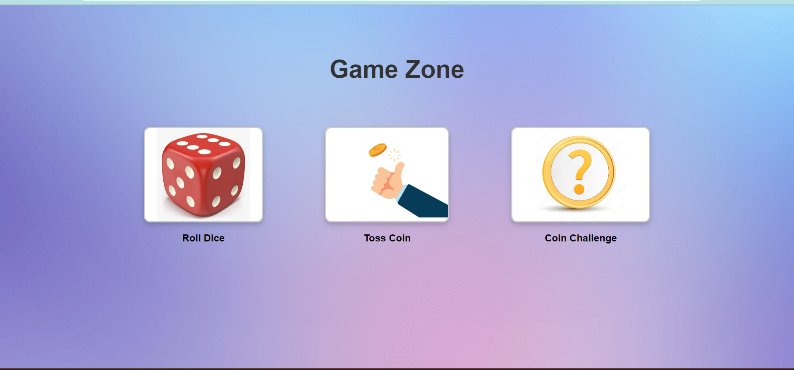
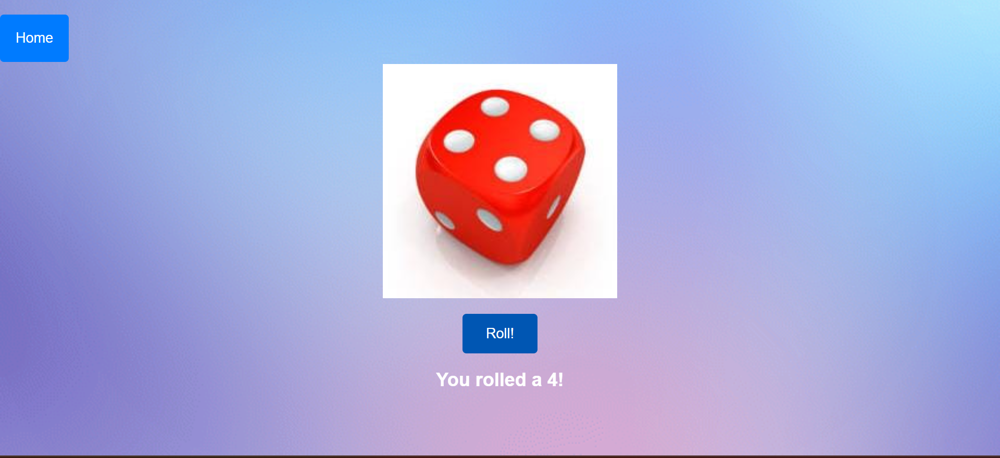
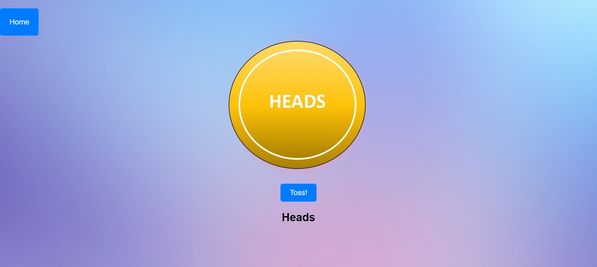
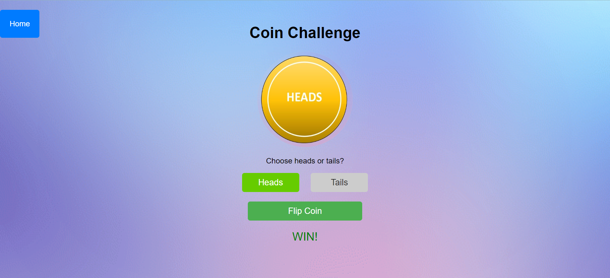

# Game of Chance

A mini web project featuring three simple games:

## Games

* Roll a Dice: Roll a virtual dice with a random outcome (1-6)
* Toss a Coin: Simulate a coin toss with a random outcome (Heads/Tails)
* Coin Challenge: Guess Heads or Tails and flip a virtual coin to determine the outcome

## Features

* Interactive gameplay with animations
* Button click sound effects
* Easy navigation between games
* Responsive design

## Technologies Used

* HTML5
* CSS3
* JavaScript (ES6+)
* Font Awesome icons
* Gradient background image

## Screenshots

### Home Page

### Roll Dice

### Toss Coin

### Coin Challenge

## Getting Started

1. Clone the repository: `git clone https://github.com/ShafiyaBanu/Mini-Project.git
2. Open Game_of_Chance.html in a web browser to access the Game Zone
3. Navigate to each game by clicking on the corresponding icon

## File Structure

* Game_of_Chance.html: Game Zone index page
* roll-dice.html: Roll a Dice game page
* toss-coin.html: Toss a Coin game page
* coin-challenge.html: Coin Challenge game page
* style.css: Shared CSS styles
* button_click.mp3: Audio file for button click sound effects

## License

This project is licensed under the MIT License.

## Contributing

Contributions are welcome! Please fork the repository and submit a pull request.

## Author

D.Shafiya Banu

## Contact

For questions or feedback, please contact [Your Email] or [Your GitHub Profile]
